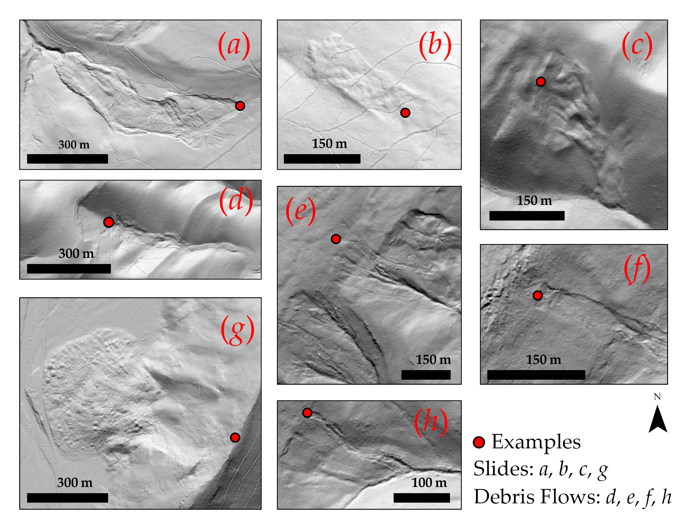
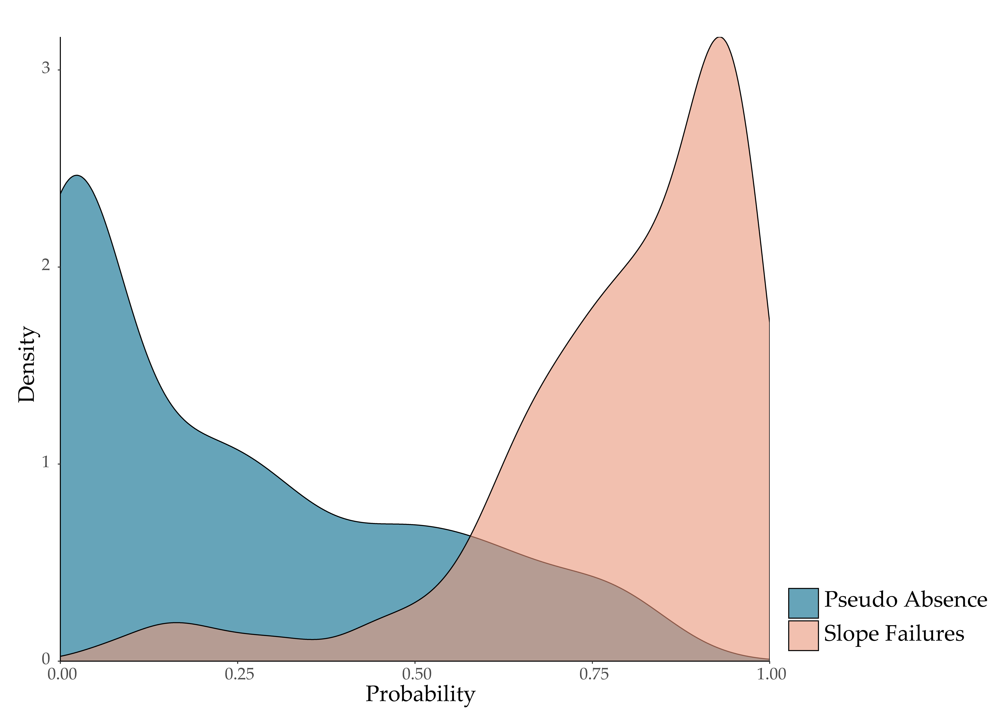
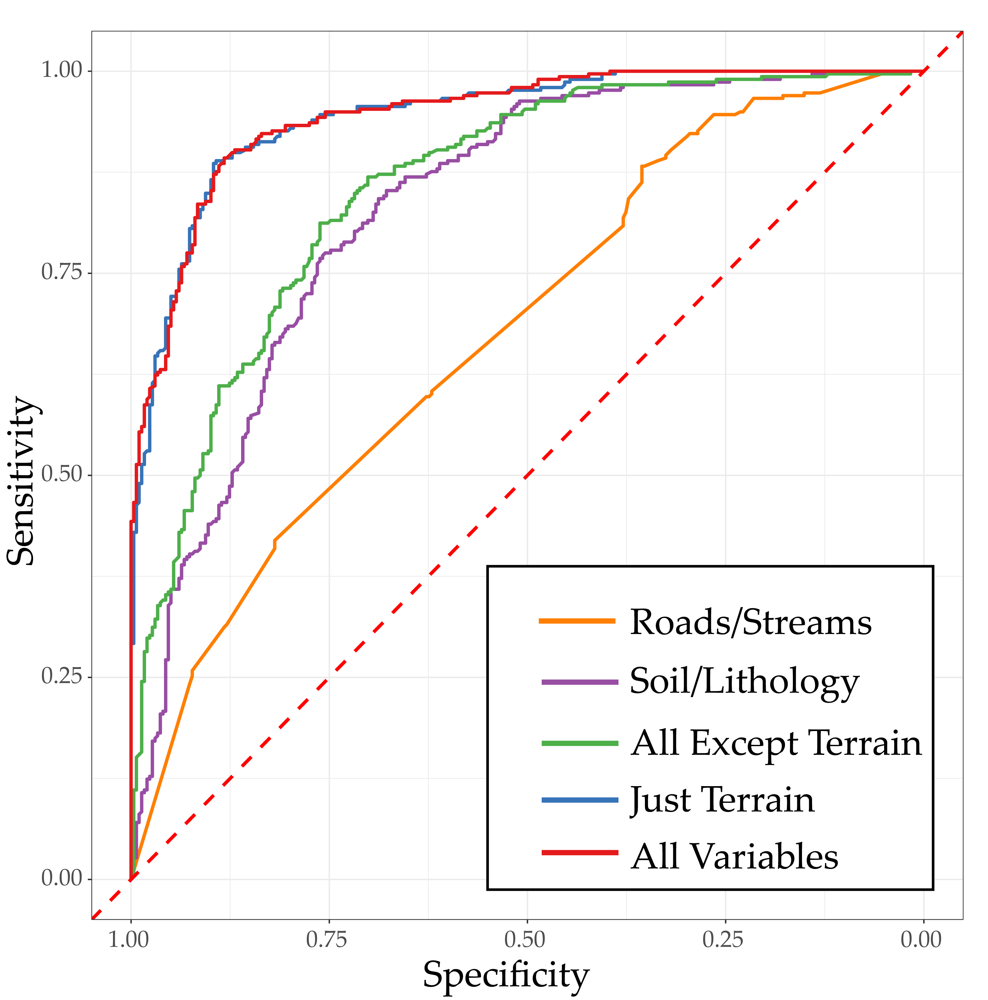

## Description

Slope failures, such as landslides, are naturally occurring geohazards that involve mass movements of rock, soil, and/or debris downslope. They can be triggered by intense precipitation and often occur in areas with steep slopes. These hazards are potentially life threatening and can cause massive amounts of damage to property and infrastructure. Therefore, it is important to understand the likelihood of landslide occurrence through machine learning, spatial predictive modeling, and probabilistic mapping to better prepare for and mitigate this hazard. Landslide probability maps are used to assess where slope failures are more likely to occur and can be of use to communities and government agencies for hazard assessment. 

This repo provides code examples for undertaking this modeling process using either the Python/ArcPy or R/SAGA data science environments. The provided code shows how to:

1. Generate terrain derivatives from digital terrain data to serve as predictor variables
2. Extract predictor variables from raster data at sample point locations to build training and validation datasets
3. Train and assess machine learing models using [scikit-learn](https://scikit-learn.org/stable/) in Python and [caret](https://topepo.github.io/caret/) in R
4. Predict back to raster data to generate spatial predictive models of the probability of slope failure occurence
5. Process large volumes of data using loops and tiling

There are several machine learning methods that can be used for probabilistic prediction. Here, we demonstrate the random forest (RF), support vector machine (SVM), and *k*-nearest neighbor (*k*-NN) methods. 
	
    
This work was undertaken by the [WV GIS Technical Center (WVGISTC)](https://wvgis.wvu.edu/index.php) and the [WVU Department of Geology and Geography](https://www.geo.wvu.edu/). This project was funded by FEMA (FEMA-4273-DR-WV-0031). The performance period for the project is 6/20/2018 to 6/4/2021.

**Project Members**

* Caleb Malay, Graduate Research Assistant, WVGISTC
* Dr. Aaron Maxwell, Assistant Professor, WVU Department of Geology and Geography/WVGISTC
* Kurt Donaldson, Senior Project Manager, WVGISTC
* Dr. Maneesh Sharma, GIS Project Lead, WVGISTC
* Dr. Steve Kite, Emeritus Professor, WVU Geology and Geography
* Shannon Maynard, Research Associate, WVGISTC

## WV Landslide Tool

This work was reported in the following publication, which is available in open access:

Maxwell, A.E., Sharma, M., Kite, J.S., Donaldson, K.A., Thompson, J.A., Bell, M.L. and Maynard, S.M., 2020. Slope Failure Prediction Using Random Forest Machine Learning and LiDAR in an Eroded Folded Mountain Belt. *Remote Sensing*, 12(3): 486. [https://doi.org/10.3390/rs12030486](https://www.mdpi.com/2072-4292/12/3/486). 

The slope failure inventory and resulting predictive models are viewable using the web-based [*WV Landslide Tool*](https://www.arcgis.com/apps/webappviewer/index.html?id=cb01c47cfa884309b4f38dcd7542f805). 

The LiDAR data used in this project can be downloaded using the [*WV Elevation and LiDAR Download Tool*](http://data.wvgis.wvu.edu/elevation/) created and supported by the WVGISTC and [West Virginia View](http://www.wvview.org/).

## Technologies

* [Python](https://www.python.org/)
* [R](https://cran.r-project.org/)
* [ArcPy](https://pro.arcgis.com/en/pro-app/latest/arcpy/get-started/installing-python-for-arcgis-pro.htm)
* [SAGA](http://www.saga-gis.org/en/index.html)

### Python Packages

* [numpy](https://numpy.org/): work with data arrays 
* [pandas](https://pandas.pydata.org/): work with data tables
* [matplotlib](https://matplotlib.org/): data visualization and graphing 
* [sklearn](https://scikit-learn.org/stable/): implement machine learning training and validation
* [rasterio](https://rasterio.readthedocs.io/en/latest/): read in and work with geospatial raster data
* [pyspatialml](https://github.com/stevenpawley/Pyspatialml): use trained models to predict to raster grids and make spatial models

### R Packages

* [caret](https://topepo.github.io/caret/): training and validating machine learning models using a consistent syntax
* [raster](https://cran.r-project.org/web/packages/raster/raster.pdf): read in and work with raster data in R
* [dplyr](https://dplyr.tidyverse.org/): data prep and manipulation
* [ggplot2](https://ggplot2.tidyverse.org/): data visualization and graphing
* [pROC](https://cran.r-project.org/web/packages/pROC/pROC.pdf): generate ROC curves and the AUC metric
* [tmap](https://github.com/mtennekes/tmap): geospatial data visualization in R
* [spatialEco](https://github.com/jeffreyevans/spatialEco): generate terrain derivatives in R
* [RSAGA](https://cran.r-project.org/web/packages/RSAGA/RSAGA.pdf): connect to [SAGA](http://www.saga-gis.org/en/index.html) to generate additional terrain variables (to use, you must install SAGA on your system either stand-alone or within [QGIS](https://qgis.org/en/site/))

---

## How To Use

The code provided here is not the original code used to generate our slope failure models and conduct the associated studies. Instead, we have generated more generic code that may be more applicable to other projects. Our original code also involved the collective use of Python, ArcPy, R, and SAGA. Here, we have tried to partition the examples so that the workflow can be accomplished using just Python/ArcPy or R/SAGA. This is so that users can undertake the process in the environment in which they are most familiar. Below, we provide descriptions of the provided scripts.

### Python

#### Scripts

1. **py_terrain_derivatives_separate.py**: create terrain variables from digital terrain models to use as predictor variables in the predictive model. Results are written out to separate raster grids. 
2. **py_terrain_derivatives_stack.py**: create terrain variables from digital terrain models to use as predictor variables in the predictive model. Results are written out as a single raster stack.
3. **py_extract_preds.py**: use arcpy to extract predictor variables at sample point locations to build training/validation datasets. You can edit this file to extract additional predictor variables. Our example is just for the terrain variables. 
4. **py_modeling.py**: prepare training/validation data, optimize models, train models, and assess models using scikit learn. 
5. **py_predict_grid.py**: use trained model to predict to a raster stack and create a probabilistic model. 
6. **py_tile_looping_pnt_ext.py**: large volumes of raster data cannot be used at once do to memory limitations. This script demonstrates how to loop through multiple tiles to generate training data and extract raster values at points.

Note that we have not yet added a predict over tiles loop. We plan to do so in the future. 

#### Terrain Variables (Python)

1. Slope Gradient (Spatial Analyst Extension)
2. Slope Position
3. Topographic Roughness 
4. Topographic Dissection 
5. Mean Slope Gradient 
6. Site Exposure Index 
7. Heat Load Index 
8. Linear Aspect 
9. Surface Relief Ratio 
10. Surface Area Ratio 
11. Mean Curvature (Raster Functions/Surface Parameters)
12. Profile Curvature (Raster Functions/Surface Parameters)
13. Tangential Curvature (Raster Functions/Surface Parameters)

Unless otherwise noted, terrain metrics were calculated using the [Geomorphometry and Gradient Metrics Toolbox](https://evansmurphy.wixsite.com/evansspatial/arcgis-gradient-metrics-toolbox).

### R

#### Scripts

1. **R_terrain_derivatives_single.R**: create terrain variables from digital terrain models to use as predictor variables in the predictive model. Results are written out to separate raster grids. 
2. **R_terrain_derivatives_stack.R**: create terrain variables from digital terrain models to use as predictor variables in the predictive model. Results are written out as a single raster stack.
3. **R_extract_preds.py**: extract predictor variables at sample point locations to build training/validation datasets. You can edit this file to extract additional predictor variables. Our example is just for the terrain variables. 
4. **R_modeling.R**: prepare training/validation data, optimize models, train models, and assess models using caret and other R packages. 
5. **R_predidct_grid.R**: use trained model to predict to a raster stack and create a probabilistic model. 
6. **R_tile_looping_pnt_ext.R**: large volumes of raster data cannot be used at once do to memory limitations. This script demonstrates how to loop through multiple tiles to generate training data and extract values at points.
6. **R_tile_looping_pred.R**: large volumes of raster data cannot be used at once do to memory limitations. This script demonstrates how to loop through multiple tiles to generate predictions as grids. 

#### Terrain Variables (R)

1. Slope Gradient (raster package)
2. Topographic Dissection (spatialEco package)
3. Surface Area Ratio (spatialEco package)
4. Surface Relief Ratio (spatialEco package)
5. TRASP Aspect Transform (spatialEco package)
6. Heat Load Index (spatialEco package)
7. Mean Slope Gradient (SAGA)
8. Profile Curvature (SAGA)
9. Plan Curvature (SAGA)
10. Cross-Sectional Curvature (SAGA)
11. Longitudinal Curvature (SAGA)
12. Topographic Roughness Index (SAGA)
13. Topographic Postion Index (SAGA)

## Example Data

We have also provided some example data to experiment with the process. Since these data are large, they could not be provided with the repo. Instead, they are avaialble [here](http://www.wvview.org/research.html) on the West Virginia View webpage. Click on the Landslides download option. 

1. **lsm_data2.csv**: table of slope failures and predictor variables used to demonstrate the use of the scripts. 
2. **stack2.tif**: raster stack with same set of predictor variables as presented in the table to assess predicting back to raster data to make predictive models. 
3. **test_loop folder**: folder that contains a set of random points, processing tiles, and a DEM to experiment with looping over tiles. 

## Additional Resources

If you are interested in learning more about machine learning and spatial predictive modeling using Python and/or R, some instructional materials have been provided on the West Virginia View webpage. The [*Open-Source GIScience*](http://www.wvview.org/open_source_gis/Open_Source_GIScience.html) course provides examples in Python while the [*Open-Source Spatial Analytics (R)*](http://www.wvview.org/Open_Source_Spatial_Analytics.html) course provides examples in R.
